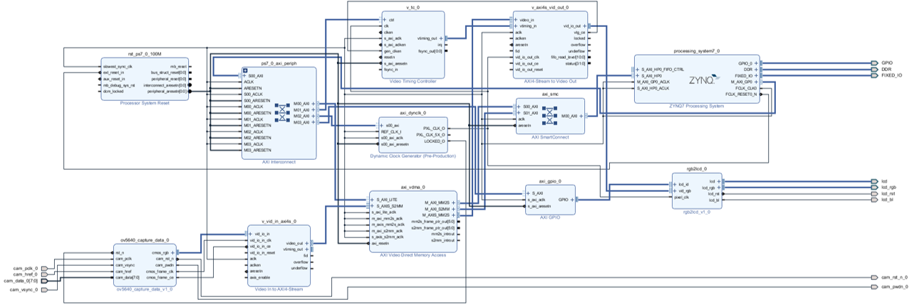

# TCP Camera

## 1 Introduction

This project is a remote camera based on **Zynq**. It provides a set of simple and easy-to-use TCP interface, which can easily obtain camera images, control camera operation and modify camera ISP parameters through the network environment.

* kernal board: Xilinx XC7Z020CLG400-2
* development board: [正点原子 领航者v2](https://detail.tmall.com/item.htm?id=609032204975&ali_refid=a3_430673_1006:1267360122:N:Z/UJ/uYBRIIpeEvXe/K1Rg==:afc3084df3cc6a47573a14115ccabe48&ali_trackid=1_afc3084df3cc6a47573a14115ccabe48&spm=a2e0b.20350158.31919782.1&skuId=4283333461236)
* camera: OV5640

## 2 Hardware Design

The hardware system consists of two side. 

The first side is the PS(Processing System) side. It consists of two ARM A9 cores, which can run embedded C language code. In our system, it is responsible for controlling the operation of the system and network communication.

The second side is the PL(Processing Logic) side. It is a piece of FPGA. We use Verilog to write the code to drive the camera and screen, and write the relevant IP core for PS and PL communication. Based on the flexibility of FPGA, we can realize any function we want in this side.

## 3 Software Design

We use pure C language to write programs. All programs run on the PS side. The program mainly performs two functions:

1. Initialize the PL end components
2. Use TCP protocol for communication

We will not describe the initialization content of PL side too much. This part of the code is mostly some fixed statements, such as executing some necessary logic for setting device initialization

